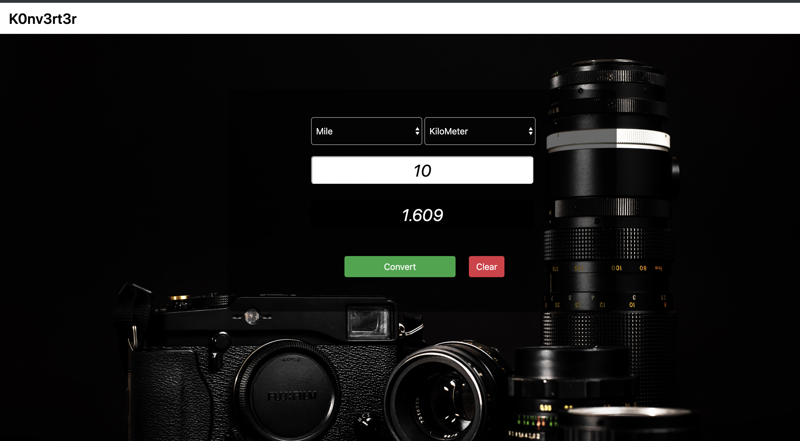

# K0nv3rt3r

#### Online length converter written in Django 

##### Getting started
- Create a vitualenv
- Add requirements (Django)

##### To run tests
 - pytests length

##### To run the server
- python manage.py runserver

##### screenshots
>Convert
